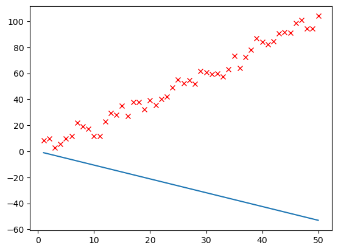
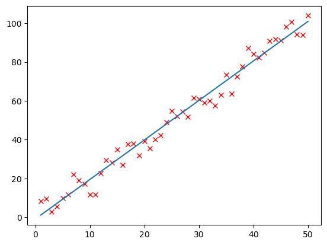
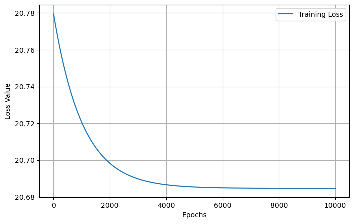

# Linear Regression (From Scratch)

This repository contains a Jupyter Notebook that implements **Linear Regression** from scratch without using high-level machine learning libraries like Scikit-Learn. It demonstrates the mathematical foundations of finding the best-fitting line for a collection of points in $\mathbb{R}^2$.

##  Project Overview

We aim to optimize the parameters:
* **$w$ (Weight)**
* **$b$ (Bias)**

1.  **Data Generation**: Creating a synthetic dataset for testing.
2.  **Model Definition**: Implementing the linear function $f(x) = wx + b$.
3.  **Gradient Descent**: Manually calculating gradients ($\frac{\partial L}{\partial w}, \frac{\partial L}{\partial b}$) to update parameters.
4.  **Training Loop**: Running the optimization over 10,000 epochs.

## Results & Visualizations

### 1. Initial State (Before Training)
At the start, the parameters $w$ (weight) and $b$ (bias) are initialized randomly. 

### 2. Final Model Fit (After Training)
After 10,000 epochs, the model has optimized $w$ and $b$. 

### 3. Learning Curve (Loss over Time)
This graph shows how the error (Loss) decreases drastically in the beginning and stabilizes as the training epochs progress.

# Linear Classification (From Scratch)

| Inicial | Final | Loss |
|--------|--------|------|
|  |  |  |
